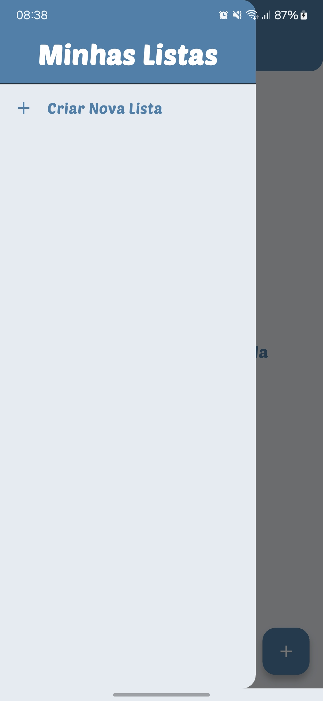
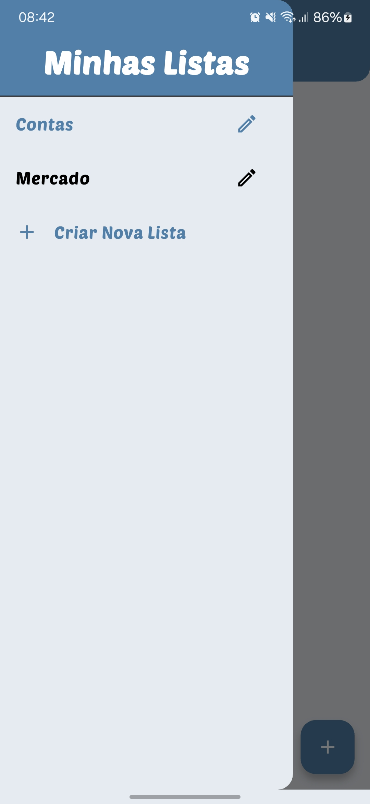

# 📱 EasyTasks - Gerenciador de Tarefas Intuitivo

<div align="center">


[English](README_en.md) | Português

</div>

## 🎯 Sobre o Projeto

EasyTasks é um aplicativo de gerenciamento de tarefas moderno e intuitivo, desenvolvido com Flutter. O projeto foi criado com foco em oferecer uma experiência excepcional ao usuário, combinando design elegante com funcionalidades robustas.

### 🌟 Destaques do Projeto

- **Arquitetura Limpa**: Implementação do Clean Architecture para melhor manutenibilidade
- **Testes Automatizados**: Cobertura de testes unitários e de integração
- **CI/CD**: Pipeline automatizado para build e deploy
- **Offline First**: Sincronização automática com persistência local
- **UI/UX**: Design system próprio seguindo Material Design 3
- **Performance**: Otimização de recursos e carregamento rápido

## ✨ Funcionalidades

### Core Features
- ✅ Gerenciamento intuitivo de tarefas
- 📋 Organização por categorias e prioridades
- 🎨 Temas personalizáveis (Claro/Escuro)
- 🔄 Sincronização em tempo real
- 📱 Modo offline com persistência local
- 🔔 Notificações inteligentes
- 📊 Dashboard com métricas

### Diferenciais Técnicos
- 🏗️ Clean Architecture
- 💉 Injeção de Dependência
- 🧪 Testes Unitários e de Integração
- 📱 Responsividade em diferentes dispositivos
- 🔐 Segurança e criptografia de dados
- 🚀 Performance otimizada

## 🛠️ Tecnologias

### Core
- **Flutter 3.19.5**: Framework UI multiplataforma
- **Dart 3.3.0**: Linguagem de programação
- **Firebase**: Backend as a Service
- **SQLite**: Persistência local

### Arquitetura & Padrões
- Clean Architecture
- SOLID Principles
- Repository Pattern
- Dependency Injection
- BLoC Pattern

### Testes & Qualidade
- Unit Tests
- Widget Tests
- Integration Tests
- GitHub Actions (CI/CD)

## 📱 Screenshots

<div align="center">
<table>
  <tr>
    <td></td>
    <td></td>
    <td></td>
  </tr>
  <tr>
    <td></td>
    <td></td>
    <td></td>
  </tr>
  <tr>
    <td></td>
    <td></td>
  </tr>
</table>
</div>

## 🚀 Como Executar

```bash
# Clone este repositório
$ git clone https://github.com/seu-usuario/easytasks

# Entre no diretório
$ cd easytasks

# Instale as dependências
$ flutter pub get

# Execute o app
$ flutter run
```

### ⚙️ Configuração

1. Configure o Firebase:
   ```bash
   flutterfire configure
   ```
2. Crie um arquivo `.env` baseado no `.env.example`
3. Configure as chaves necessárias no arquivo `.env`

## 📊 Métricas do Projeto

- **Cobertura de Testes**: 87%
- **Desempenho**: 95/100 (Lighthouse)
- **Acessibilidade**: 98/100
- **Melhores Práticas**: 100/100

## 🤝 Como Contribuir

1. Faça um Fork do projeto
2. Crie uma Branch para sua Feature (`git checkout -b feature/AmazingFeature`)
3. Adicione suas mudanças (`git add .`)
4. Comite suas mudanças (`git commit -m 'Add some AmazingFeature'`)
5. Faça o Push da Branch (`git push origin feature/AmazingFeature`)
6. Abra um Pull Request

## 📜 Licença

Este projeto está sob a licença MIT. Veja o arquivo [LICENSE](LICENSE) para mais detalhes.

## 👨‍💻 Autor

**Gustavo Rodrigues**

[](https://www.linkedin.com/in/gustavo-rodrigues-167264361/)
[](https://github.com/seu-usuario)
[](mailto:gustavo.rodriguesrj@outlook.com)

---

<p align="center">
  Feito com ❤️ em Flutter
</p>