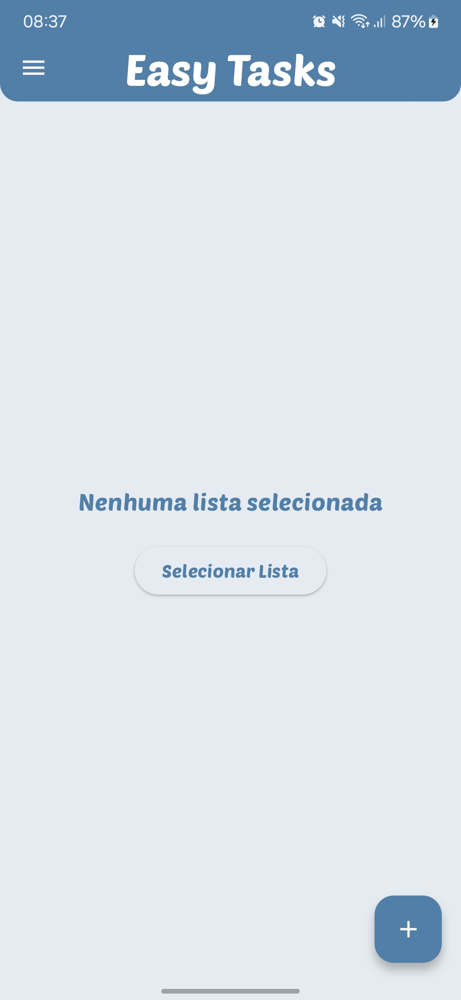
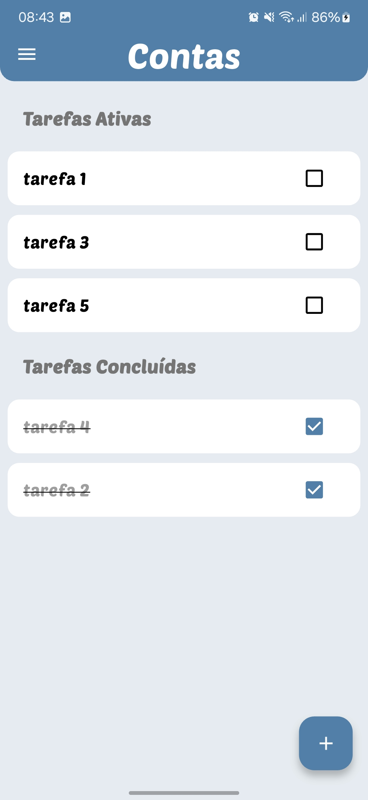
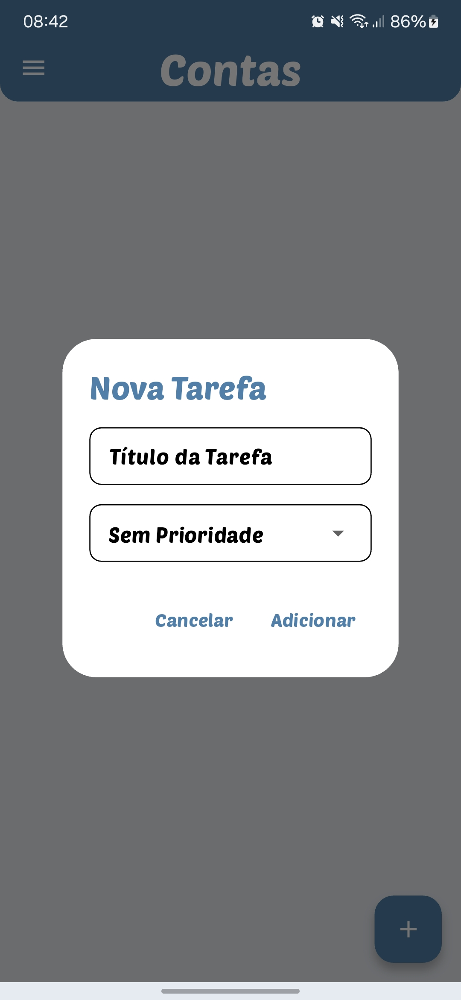
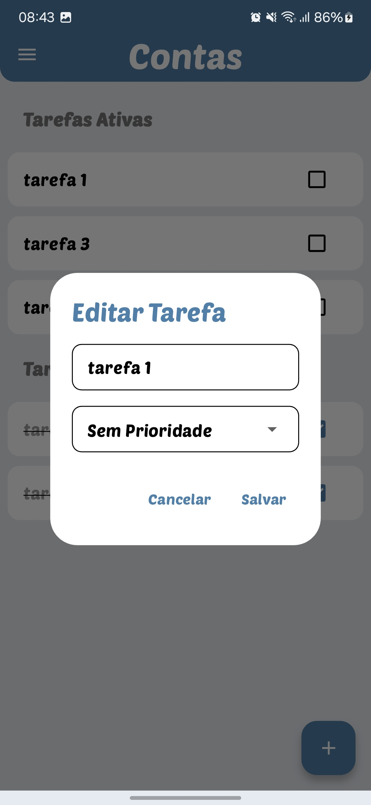
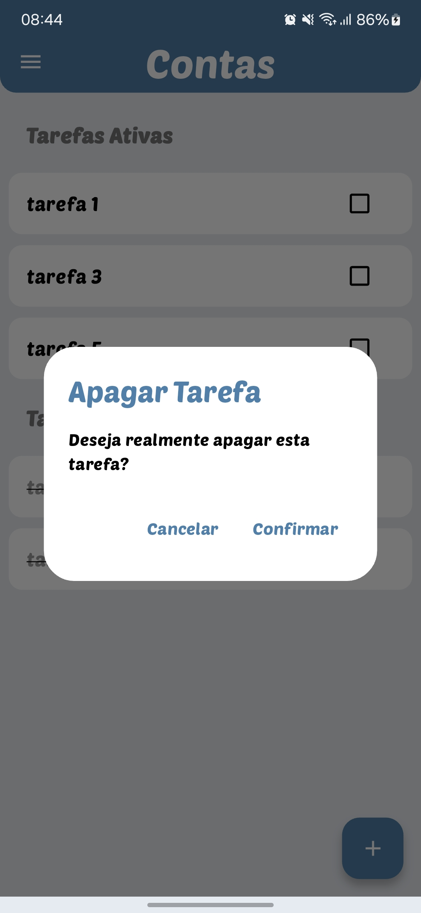

# 📱 EasyTasks - Gerenciador de Tarefas Intuitivo


**Organize sua vida de forma simples e eficiente!** 
EasyTasks é um aplicativo de gerenciamento de tarefas com foco em usabilidade e produtividade.

---

## ✨ Funcionalidades Principais

- ✅ **Listas Organizáveis** - Crie listas personalizadas (Trabalho, Casa, etc).
- 🚨 **Sistema de Prioridades** - Alta, Média, Baixa e Sem Prioridade.
- ✔️ **Status de Conclusão** - Marque tarefas como ativas/concluídas.
- 🎨 **Temas Personalizáveis** - Modo claro/escuro automático.
- 📱 **Offline First** - Funciona sem internet com armazenamento local seguro.
- ✏️ **Edição Fácil** - Toque prolongado para editar/remover.
- 📤 **Backup Simples** - Exportação/importação de dados.

---

## 🛠️ Tecnologias Utilizadas

- **Flutter 3.19** - Framework multiplataforma.
- **Dart 3.3** - Linguagem de programação.
- **SharedPreferences** - Armazenamento local.
- **Material Design 3** - Design system moderno.

---

## 🚀 Como Executar o Projeto

### Disponível na Play Store

Você pode baixar e instalar o aplicativo diretamente na Play Store:

[](https://play.google.com/store/apps/details?id=com.seuusuario.easytasks)

---

## 📂 Estrutura do Projeto

```plaintext
lib/
├── main.dart                # Ponto de entrada do aplicativo
├── components/              # Componentes reutilizáveis
├── models/                  # Modelos de dados (Task)
├── screens/                 # Telas do aplicativo
├── services/                # Serviços para manipulação de dados
├── utils/                   # Temas e utilitários
└── widgets/                 # Widgets reutilizáveis
```

---

## 🖼️ Screenshots

<p align="center"> 
 
 
 
 
 
 
</p>     

---

## 📧 Contato
**Autor:** Gustavo Rodrigues
**Email:** gustavo.rodriguesrj@outlook.com
**LinkedIn:** [Seu LinkedIn](https://www.linkedin.com/in/gustavo-rodrigues-167264361?utm_source=share&utm_campaign=share_via&utm_content=profile&utm_medium=android_app)

---

Desenvolvido com ❤️ usando Flutter.