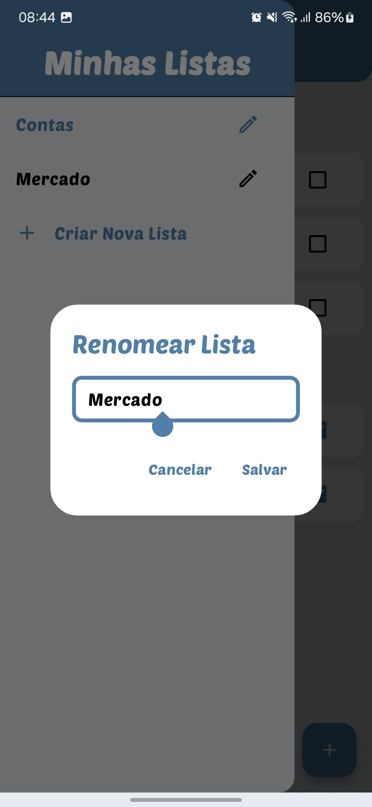

# 📱 EasyTasks - Gerenciador de Tarefas Intuitivo

---

## 🎯 Sobre o Projeto

**EasyTasks** é um aplicativo de gerenciamento de tarefas moderno e responsivo, desenvolvido com **Flutter** e integração com **Firebase**.  
Ele permite que os usuários criem, editem, organizem e sincronizem suas tarefas com facilidade, tanto em dispositivos móveis quanto na web.

> ✅ A versão web está disponível em: [https://flutter-easytasks.vercel.app](https://flutter-easytasks.vercel.app)

---

## 🌟 Destaques

- ✅ Autenticação de usuários com Firebase Auth  
- ☁️ Armazenamento em nuvem com Cloud Firestore  
- 🧠 Arquitetura baseada em MVC (Model-View-Controller)  
- 📱 Responsividade completa (mobile, tablet e web)  
- 🚀 Deploy web feito com Vercel  
- ✨ Clean Code e separação de responsabilidades

---

## ✨ Funcionalidades

- 📋 Criação e organização de tarefas por listas  
- 🎯 Prioridades e status por tarefa  
- 🗑️ Exclusão, edição e conclusão de tarefas  
- 🔄 Sincronização em tempo real com Firestore  
- 🌐 Login com autenticação segura (Firebase)  
- 🎨 Interface moderna com Material Design 3  
- 💡 Salvamento automático de alterações

---

## 🛠️ Tecnologias Utilizadas

### Core
- **Flutter 3.19.5**
- **Dart 3.3.0**
- **Firebase Auth**
- **Cloud Firestore**

### Arquitetura e Boas Práticas
- MVC (Model-View-Controller)
- Clean Code
- Modularização

### Plataforma
- Flutter Web
- Vercel (Deploy da versão web)

---

## 📷 Screenshots

<table>
  <tr>
    <td></td>
    <td></td>
    <td></td>
  </tr>
  <tr>
    <td></td>
    <td></td>
    <td></td>
  </tr>
  <tr>
    <td></td>
    <td></td>
  </tr>
</table>

---

## 📧 Contato

**Autor:** Gustavo Rodrigues

**Email:** gustavo.rodriguesrj@outlook.com

**LinkedIn:** [Meu Perfil](https://www.linkedin.com/in/gustavo-rodrigues-167264361?utm_source=share&utm_campaign=share_via&utm_content=profile&utm_medium=android_app)

---

Desenvolvido com ❤️ usando Flutter.
