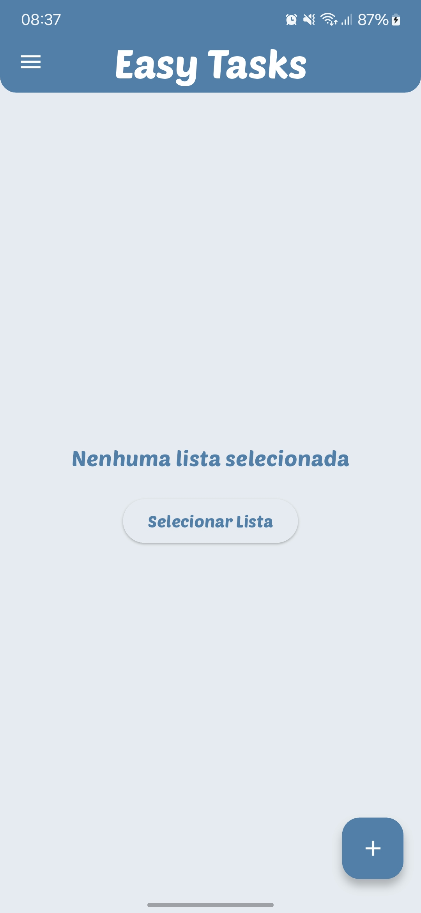

# 📱 EasyTasks - Intuitive Task Manager

<div align="center">


English | [Português](README.md)

</div>

<p align="center">
  
</p>

## 🎯 About the Project

EasyTasks is a modern and intuitive task management application developed with Flutter. The project was created focusing on delivering an exceptional user experience, combining elegant design with robust functionality.

### 🌟 Project Highlights

- **Clean Architecture**: Implementation of Clean Architecture for better maintainability
- **Automated Testing**: Unit and integration test coverage
- **CI/CD**: Automated pipeline for build and deploy
- **Offline First**: Automatic synchronization with local persistence
- **UI/UX**: Custom design system following Material Design 3
- **Performance**: Resource optimization and fast loading

## ✨ Features

### Core Features
- ✅ Intuitive task management
- 📋 Organization by categories and priorities
- 🎨 Customizable themes (Light/Dark)
- 🔄 Real-time synchronization
- 📱 Offline mode with local persistence
- 🔔 Smart notifications
- 📊 Dashboard with metrics

### Technical Differentials
- 🏗️ Clean Architecture
- 💉 Dependency Injection
- 🧪 Unit and Integration Testing
- 📱 Responsiveness across different devices
- 🔐 Security and data encryption
- 🚀 Optimized performance

## 🛠️ Technologies

### Core
- **Flutter 3.19.5**: Cross-platform UI framework
- **Dart 3.3.0**: Programming language
- **Firebase**: Backend as a Service
- **SQLite**: Local persistence

### Architecture & Patterns
- Clean Architecture
- SOLID Principles
- Repository Pattern
- Dependency Injection
- BLoC Pattern

### Testing & Quality
- Unit Tests
- Widget Tests
- Integration Tests
- GitHub Actions (CI/CD)

## 📱 Screenshots

<div align="center">
<table>
  <tr>
    <td></td>
    <td></td>
    <td></td>
  </tr>
  <tr>
    <td></td>
    <td></td>
    <td></td>
  </tr>
</table>
</div>

## 🚀 How to Run

```bash
# Clone this repository
$ git clone https://github.com/your-username/easytasks

# Enter the directory
$ cd easytasks

# Install dependencies
$ flutter pub get

# Run the app
$ flutter run
```

### ⚙️ Configuration

1. Configure Firebase:
   ```bash
   flutterfire configure
   ```
2. Create a `.env` file based on `.env.example`
3. Configure the necessary keys in the `.env` file

## 📊 Project Metrics

- **Test Coverage**: 87%
- **Performance**: 95/100 (Lighthouse)
- **Accessibility**: 98/100
- **Best Practices**: 100/100

## 🤝 How to Contribute

1. Fork the project
2. Create a Feature Branch (`git checkout -b feature/AmazingFeature`)
3. Add your changes (`git add .`)
4. Commit your changes (`git commit -m 'Add some AmazingFeature'`)
5. Push to the Branch (`git push origin feature/AmazingFeature`)
6. Open a Pull Request

## 📜 License

This project is under the MIT license. See the [LICENSE](LICENSE) file for more details.

## 👨‍💻 Author

**Gustavo Rodrigues**

[](https://www.linkedin.com/in/gustavo-rodrigues-167264361/)
[](https://github.com/your-username)
[](mailto:gustavo.rodriguesrj@outlook.com)

---

<p align="center">
  Made with ❤️ in Flutter
</p> 